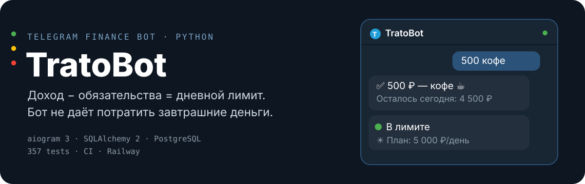

<p align="center">
  
</p>

Telegram-бот для учёта личных финансов. Отвечает на один вопрос каждое утро: **сколько можно потратить сегодня**, чтобы хватило до конца периода.

Пишешь `500 кофе` — бот сам определяет категорию, вычитает из дневного лимита и показывает остаток. Вечером подводит итог, утром даёт план. Если лимит просел — предлагает план восстановления с реальной математикой.

---

## Как это выглядит

**Утро, 08:00.** Бот присылает план на день и разбор вчерашнего:

> ☀️ Доброе утро, бро!
> 📋 План на сегодня: 5 000 ₽/день
> 📅 Вчера: ты потратил 4 200 ₽ из 5 000 ₽ — уложился 👌
> 🟢 Бро, ты машина. Прогноз — 5 000 ₽/день. Держим курс.

**Вечер, 22:00.** Тизер с тем, что уже записано. Записываешь забытое — хоть одной строкой, хоть чеком целиком:

> 350 кофе
> 1200 обед
> 450 такси

Математика прямо во вводе: `1500+2000+450 обед с коллегами` — парсер без `eval`, опечатки правит сам (`500++300` → подсказка «убрал лишний знак»).

**Перебор.** Прогноз упал ниже 85% от базового лимита — бот предлагает восстановление на выбор:

> ⚡ Быстро — 60% от базового, 3 дня
> ⚖️ Сбалансированно — 70%, 5 дней
> 🌿 Мягко — 80%, 8 дней

Каждый вечер — счёт: «Потрачено X из Y · сэкономлено Z». Вышел в норму — «Обычный лимит снова твой 🎉».

---

## Что реально работает

| Сценарий | Механика |
|----------|----------|
| Свободный ввод трат | текст, многострочный чек, математические выражения |
| Авто-категоризация | 4-уровневый матчер (keywords → difflib → средний чек → «Прочее») + self-learning: ручная правка добавляет слово в keywords |
| Дневной лимит и зоны | 🟢 в лимите / 🔵 можно больше / 🟡 на грани / 🔴 критично, прогноз пересчитывается от остатка |
| Утренний отчёт 08:00 МСК | план + вчерашний итог + зона + recovery-контекст, дедупликация через `daily_reports_log` |
| Вечерняя сессия 22:00 + автозакрытие 23:30 | контейнер с живым списком, итог дня, recovery-фидбек |
| Месячный отчёт | Rich HTML: разбивка по категориям, тотем топ-категории, навигация по периодам |
| Recovery mode | Decimal-математика, cooldown 3 дня, пересчёт при изменении бюджета, авто-завершение при успехе |
| Ролловер периода | «Оставить всё» / «Изменить» с умными дефолтами из прошлого месяца |
| Пересчёт по реальному балансу | снапшот `free_money + spent_at_recalc` в одной транзакции |
| История | пагинация, редактирование суммы, soft delete + undo |
| Категории | rename / archive / delete с выбором (в архив / перенести траты / удалить с тратами) |
| Защита от дублей | 15-секундное окно, warn / confirm / silent-drop, идемпотентность при ретраях Telegram |
| Rate limiting | 5 событий за 3 секунды |

**Честно отсутствует:** LLM/AI (0 вызовов в коде), экспорт CSV/Excel/PDF, push-уведомления вне Telegram, сплит расходов, голосовой ввод, общие бюджеты.

---

## Стек

Python 3.12 · aiogram 3.x · SQLAlchemy 2.0 (async) · PostgreSQL (prod, asyncpg) / SQLite (dev, aiosqlite) · APScheduler · pydantic-settings · aiohttp (Rich API)

```
src/bot/handlers/   menu, history, categories, evening_flow
src/bot/            middleware (×4), scheduler (3 cron), rich_api, keyboards
src/services/       budget, expense, categorization, morning/evening report,
                    monthly_report, recovery, goal, user
src/db/             async engine, hand-rolled кросс-диалектные миграции, 9 таблиц
src/utils/          math-парсер без eval, safe() для HTML, phrases.py (копирайт)
```

Решения, за которые не стыдно: миграции с identifier-whitelisting вместо Alembic, снапшот-канон `money_for_life`, полуинтервал `[period_start, next_day)` для агрегаций, `pool_pre_ping` + `statement_cache_size: 0` для asyncpg, in-memory SQLite + monkeypatch session factory в тестах.

---

## Запуск

```bash
pip install -r requirements.txt
cp .env.example .env   # BOT_TOKEN, DATABASE_URL
python -m src.bot.main
```

Docker: `python:3.12-slim`, `CMD ["python", "-m", "src.bot.main"]`. Деплой — Railway (Dockerfile builder, 1 реплика).

---

## Тесты и качество

**357 тестов** (pytest + pytest-asyncio, hermetic in-memory SQLite): unit (парсер — 76, helpers — 52, категоризация — 51), интеграционные с БД (74), handler/FSM с моками (90).

CI (GitHub Actions, Python 3.12): `ruff check` → `ruff format --check` → `mypy` → `pytest`. Pre-commit: те же проверки + полный прогон тестов.

---

## Документация

| Файл | О чём |
|------|-------|
| `PRD.md` | Продуктовая спецификация |
| `RULES.md` | Правила разработки |
| `progress.md` | Журнал сессий, баги B1–B5 и решения |
| `SESSION_PLAN.md` | План работ по неделям |
| `docs/PHRASE_MAP.md` | Карта всех фраз бота |

## Структура проекта

```
tratobot/
├── src/
│   ├── bot/
│   │   ├── handlers/   # menu.py, history.py, categories.py, evening_flow.py, test_commands.py
│   │   ├── keyboards.py
│   │   ├── middleware.py
│   │   ├── scheduler.py
│   │   └── main.py
│   ├── services/        # budget, expense, categorization, category, morning/evening report,
│   │                    # monthly_report, recovery, goal, user
│   ├── db/
│   │   ├── models/
│   │   └── database.py
│   ├── utils/           # helpers.py, phrases.py
│   └── core/
│       └── config.py
├── assets/readme/       # hero.svg
├── tests/               # 357 тестов
├── .github/workflows/   # CI (GitHub Actions)
├── .pre-commit-config.yaml
├── Dockerfile
├── railway.json
├── pyproject.toml
├── requirements.txt
├── requirements-dev.txt
├── PRD.md
├── RULES.md
└── progress.md
```
